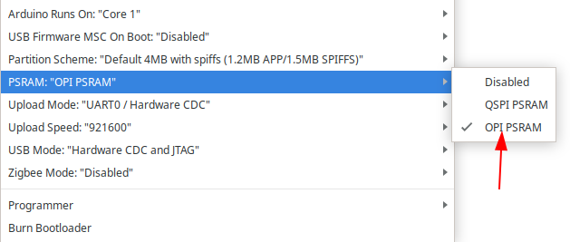
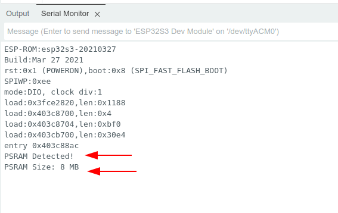

## Uji GPIO yang terhubung ke WS2812

```C++
#include <Adafruit_NeoPixel.h>

// Daftar GPIO yang ingin diuji
int gpioList[] = {48, 38, 16, 8, 2, 4, 5, 12, 13, 14, 15, 18, 19, 21, 22, 23, 25, 26, 27, 32, 33, 34, 35, 36, 37};
// Jumlah GPIO dalam daftar
int gpioCount = sizeof(gpioList) / sizeof(gpioList[0]);

#define NUMPIXELS 1
Adafruit_NeoPixel pixels(NUMPIXELS, 0, NEO_GRB + NEO_KHZ800);

void setup() {
  Serial.begin(115200);
  pixels.begin();
}

void loop() {
  for (int i = 0; i < gpioCount; i++) {
    int currentPin = gpioList[i];
    pixels.setPin(currentPin);  // Set GPIO yang akan diuji
    pixels.begin();              // Inisialisasi ulang untuk memastikan perubahan PIN
    
    Serial.print("Testing GPIO: ");
    Serial.println(currentPin);

    // Set warna merah untuk menguji
    pixels.setPixelColor(0, pixels.Color(255, 0, 0));
    pixels.show();
    delay(1000);                 // Tunggu untuk melihat apakah LED menyala

    // Matikan LED untuk pindah ke GPIO berikutnya
    pixels.setPixelColor(0, pixels.Color(0, 0, 0));
    pixels.show();
    delay(500);
  }

  Serial.println("Testing selesai. Mengulang kembali...");
  delay(2000); // Tunggu sebentar sebelum mengulangi tes
}

```

Untuk memodifikasi program ini agar dapat menguji seluruh GPIO pada ESP32-S3 YD-ESP32-S3, kita perlu melakukan loop melalui daftar GPIO yang memungkinkan untuk digunakan. Setiap GPIO akan diuji satu per satu sebagai pin kontrol untuk WS2812. Jika lampu LED menyala, kita bisa tahu bahwa GPIO tersebut terhubung ke WS2812.

Berikut adalah modifikasi kode yang akan menguji GPIO yang tersedia dan menampilkan hasilnya di Serial Monitor:Penjelasan

- `gpioList[]`: Daftar GPIO yang akan diuji. Anda dapat menyesuaikan daftar ini sesuai kebutuhan Anda.
- Loop pada `gpioList[]`: Kode akan mencoba setiap GPIO dalam daftar sebagai pin kontrol untuk WS2812.
- Output Serial: Program akan menampilkan nomor GPIO yang sedang diuji di Serial Monitor.
- Delay: Memberikan waktu untuk melihat apakah LED menyala pada setiap GPIO.

##  Tipe PSRAM (OPI atau QSPI) pada ESP32-S3:

Pada perangkat ESP32-S3, PSRAM (Pseudo-Static RAM) menjadi komponen penting untuk mendukung aplikasi yang membutuhkan memori tambahan, seperti pengolahan gambar, audio, atau aplikasi IoT yang kompleks. PSRAM dapat menggunakan antarmuka **OPI (Octal Peripheral Interface)** atau **QSPI (Quad Peripheral Interface)**, yang menentukan jumlah jalur data dan kecepatan transfernya. Penting untuk memastikan tipe antarmuka PSRAM yang digunakan agar konfigurasi perangkat lunak, seperti pada Arduino IDE atau platform pengembangan lainnya, sesuai dengan spesifikasi hardware.

Langkah berikut akan membantu Anda memverifikasi apakah PSRAM pada ESP32-S3 Anda menggunakan OPI atau QSPI, baik melalui  uji coba langsung melalui kode dan  konfigurasi perangkat lunak yang ada di arduino

Tahapan yang harus dilakukan 

1.  Buka Arduino Ide Anda
2. copy paste program berikut

```c++
#include <esp32-hal-psram.h>

void setup() {
  Serial.begin(115200);
  if (psramFound()) {
    Serial.println("PSRAM Detected!");
    size_t psramSize = ESP.getPsramSize() / (1024 * 1024);
    Serial.print("PSRAM Size: ");
    Serial.print(psramSize);
    Serial.println(" MB");
  } else {
    Serial.println("No PSRAM Detected!");
  }
}

void loop() {
  // Do nothing
}
```

3. Pilih ukuran Flash yang sesuai dengan board anda

.png)

4. Konfigurasi PSRAM menjadi tipe OPI PSRAM



5. upload program

6. bila berhasil  akan muncul tampilan seperti ini



6. coba anda ganti PSRAM dari OPI menjadi QSPI dan ulangi lagi
6. dari hasil anda akan tahu apakah tipe PSRAM anda OPI atau PSI, pada contoh di atas tipe PSRAM adalah OPI 

